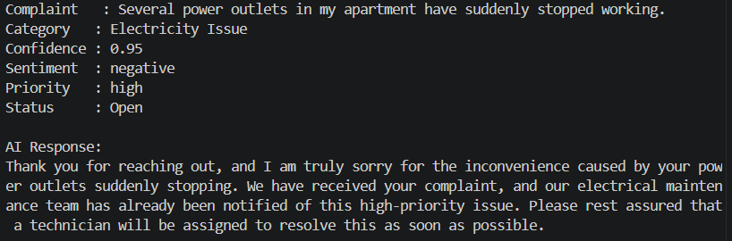

# AI-Powered Facility Management System

An AI-powered facility management system designed to automate the processing of customer complaints and maintenance requests.

The system analyzes customer call transcripts using NLP and machine learning to automatically:

- Classify complaints into facility management categories
- Detect customer sentiment
- Determine ticket priority based on issue severity and complaint content
- Generate professional customer responses using Google Gemini
- Create and manage maintenance tickets
- Store customer, call, and ticket information in a database
- Expose the system through RESTful APIs using FastAPI

## AI Pipeline

Customer Call / Transcript ->
Complaint Classification ->
Sentiment Analysis ->
Priority Detection ->
Ticket Creation ->
AI-Generated Customer Response ->
Database

## Example

## Future Improvements

- Add real-time voice call simulation with speech-to-text and text-to-speech capabilities.
- Improve the AI-powered ticket classification and priority detection.
- Enhance the generated AI responses to provide more contextual and personalized replies.
- Add new facility management features and expand the supported complaint categories.
- Improve the overall system performance, reliability, and user experience.

## Technologies

- Python
- FastAPI
- SQLAlchemy
- SQLite
- BERT
- NLP
- Google Gemini API
- Pydantic
- HTTPX
