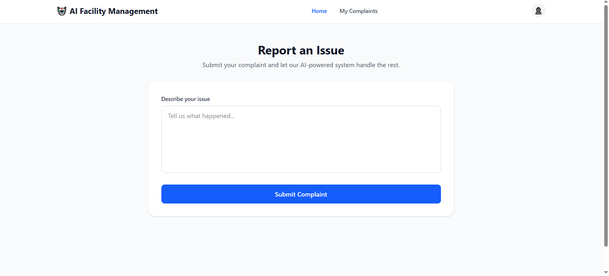
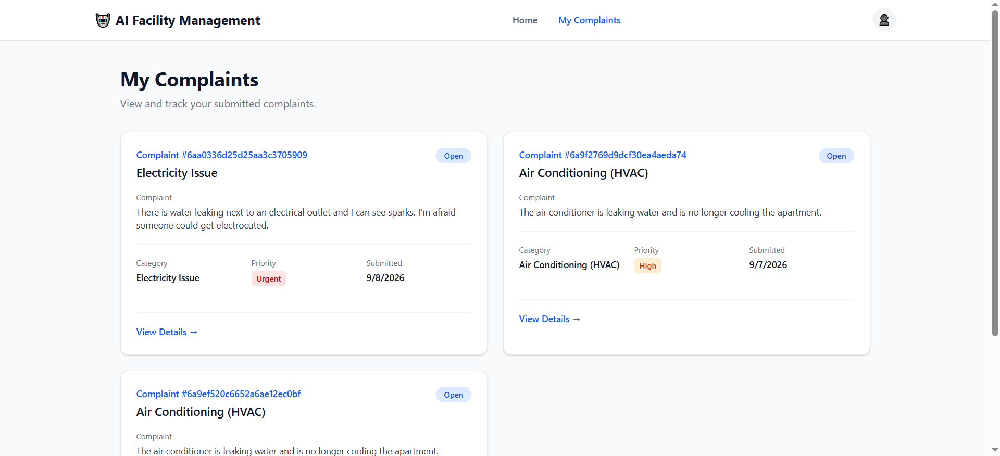
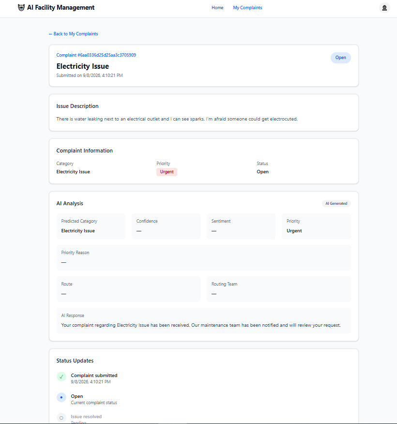

# AI-Powered Facility Management System

An AI-powered facility management system designed to automate the processing and management of customer complaints and maintenance requests.

The system uses an AI Agent built with LangGraph to orchestrate and make decisions throughout the complaint-processing workflow. It automatically:

1. Classifies complaints into facility management categories using a BERT-based NLP classifier
2. Detects customer sentiment using Google Gemini
3. Determines ticket priority based on issue severity, complaint content, sentiment, and classification confidence
4. Makes workflow decisions and routes complaints based on their priority
5. Generates professional customer responses using Google Gemini
6. Creates and manages maintenance tickets
7. Stores customer, call, apartment, building, and ticket information in MongoDB
8. Exposes RESTful APIs using FastAPI
9. Provides a React-based interface for submitting and monitoring complaints

## AI Pipeline

                         ┌──────────────────────┐
                         │   Customer Complaint │
                         │      / Call Text     │
                         └──────────┬───────────┘
                                    │
                                    ▼
                         ┌──────────────────────┐
                         │  Load Customer Data  │
                         │ Building + Apartment │
                         └──────────┬───────────┘
                                    │
                                    ▼
                         ┌──────────────────────┐
                         │    Validate Call     │
                         │ Customer ↔ Call      │
                         └──────────┬───────────┘
                                    │
                                    ▼
                         ┌──────────────────────┐
                         │   BERT Classifier    │
                         │ Complaint Category   │
                         │ + Confidence Score   │
                         └──────────┬───────────┘
                                    │
                                    ▼
                         ┌──────────────────────┐
                         │  Sentiment Analysis  │
                         │       Gemini LLM     │
                         └──────────┬───────────┘
                                    │
                                    ▼
                         ┌──────────────────────┐
                         │ Priority Determination│
                         │ Urgent / High / Med  │
                         │        / Low         │
                         └──────────┬───────────┘
                                    │
                         ┌──────────┴───────────┐
                         │   Agent Decision     │
                         │  Conditional Routing │
                         └──────────┬───────────┘
                                    │
                  ┌─────────────────┼─────────────────┐
                  ▼                 ▼                 ▼
          ┌──────────────┐  ┌──────────────┐  ┌──────────────┐
          │   URGENT     │  │     HIGH     │  │ NORMAL       │
          │ Emergency    │  │  Fast Track  │  │ Standard     │
          │    Path      │  │    Path      │  │    Path      │
          └──────┬───────┘  └──────┬───────┘  └──────┬───────┘
                 │                 │                 │
                 └─────────────────┼─────────────────┘
                                   ▼
                         ┌──────────────────────┐
                         │  Generate Customer   │
                         │    Response (LLM)    │
                         └──────────┬───────────┘
                                    │
                                    ▼
                         ┌──────────────────────┐
                         │    Create Ticket     │
                         │      MongoDB         │
                         └──────────────────────┘

## Screenshots
#### Home

The main dashboard provides an overview of the facility management system, and allows users to access the complaint management workflow.

#### Complaints

Users can view and monitor their submitted maintenance complaints, including ticket status, priority, and category.

#### Complaint Details

Provides detailed information about an individual complaint, including the detected category, priority, status, AI-generated response, and complaint information.

## Future Improvements

- Add real-time voice call simulation with speech-to-text and text-to-speech capabilities.
- Improve the AI-powered ticket classification and priority detection.
- Enhance the generated AI responses to provide more contextual and personalized replies.
- Add new facility management features and expand the supported complaint categories.
- Improve the overall system performance, reliability, and user experience.

## Technologies

AI Agent: LangGraph

NLP Classification: BERT / Hugging Face Transformers

LLM: Google Gemini

Backend: FastAPI / Python

Database: MongoDB / PyMongo

Frontend: React / Tailwind CSS
